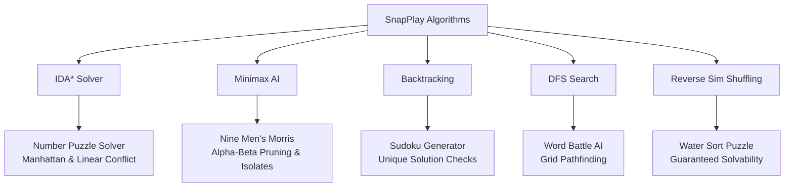

# 📱 SnapPlay: 30+ Offline Mini Games Collection
## 📄 Technical Project Report & Architectural Specification

---

## 📋 Executive Summary
**SnapPlay** is an elite, high-performance offline mini-games collection built using the Flutter framework. Featuring a catalog of over 25 classic and modern games (such as Ludo, Chess, Carrom, 2048, and Sudoku), SnapPlay is engineered to deliver a console-grade mobile gaming experience with zero loading lag, interactive haptics, dynamic audio, and a premium visual aesthetic. 

The application utilizes a hybrid monetization strategy comprising Google Mobile Ads (Banner, Interstitial, and Rewarded) and In-App Purchases (IAP) for premium/ad-free upgrades, all while maintaining strict user-experience bounds through frequency capping.

---

## 🛠️ Technology Stack & Dependencies

SnapPlay is built on a modern mobile development stack tailored for low latency and high portability:

| Technology Component | Dependency / Package | Purpose |
| :--- | :--- | :--- |
| **Core Framework** | `Flutter (Dart SDK ^3.10.4)` | Cross-platform UI compilation for iOS, Android, Web, and Desktop. |
| **Action Game Engine** | `Flame Game Engine (^1.18.0)` | Powers physics-based and real-time collision-based games. |
| **State Management** | `Provider (^6.1.2)` | Global state, ad lifecycle, and visual settings management. |
| **Data Persistence** | `Shared Preferences (^2.2.3)` | Local saving of high scores, sound/vibration toggles, and store ownership. |
| **Haptic Feedback** | `Vibration (^2.0.0)` | Tactile gameplay feedback for moves, scores, checkmates, and game-overs. |
| **Audio Processing** | `Audioplayers (^6.0.0)` | Multi-channel sound effects and background music system. |
| **Vector Rendering** | `Flutter SVG (^2.2.3)` | Renders crisp UI assets without scaling artifacts. |
| **Animations** | `Flutter Animate (^4.5.2)` & `Lottie (^3.3.2)` | Dynamic, hardware-accelerated transitions and vector animations. |
| **Monetization (Ads)** | `Google Mobile Ads (^5.1.0)` | Integration for Banner, Interstitial, and Rewarded ads. |
| **Monetization (IAP)** | `In App Purchase (^3.2.3)` | Native App Store and Google Play billing for ad removal. |

---

## 🎮 Game Catalog & Categories

The games are designed to cater to different types of players and are categorized accordingly:

### ♟️ 1. Classic Board Games
* **Ludo**: Local multiplayer implementation with animated dice rolling and pathfinding token rules.
* **Chess**: Standard chess rules featuring checkmate/stalemate checks, move history, en passant, and pawn promotion.
* **Carrom**: 2D custom-painted physics board focusing on puck-to-puck collisions and friction-based deceleration.
* **Nine Men's Morris**: Strategy board game featuring token placement, movement, flying phases, and mill formation checks.
* **Dots and Boxes**: Grid-based line-drawing board game for territory capturing.

### 🧩 2. Puzzle & Logic Games
* **Sudoku**: Mathematical grid puzzle featuring automatic board generation and conflict highlighting.
* **Game 2048**: Classic grid-sliding tile-merging puzzle with instant undo states.
* **Water Sort**: Color-sorting test-tube puzzle.
* **Number Puzzle (15-Puzzle)**: Sliding tile game to arrange numbers in sequential order.
* **Match 3**: Candy-matching puzzle with cascade logic.

### ⚡ 3. Action & Physics Games
* **Brick Breaker**: Classic arcade brick-demolishing game with paddle controls, multiple levels, and ball physics.
* **Ping Pong**: Retro arcade table tennis with sliding paddles.
* **Air Hockey**: Fast-paced striker-and-puck friction game with mallet physics.
* **Knife Hit**: Precision timing game where knives are thrown at rotating wooden targets.
* **Space Shooter Duel**: 2D retro space shooter with ship movement, bullet physics, and collision bounding.
* **Asteroids**: Space debris avoidance and demolition simulator.

### 🎈 4. Casual & Reflex Games
* **Balloon Pop**: Quick reflex balloon tapping game.
* **Snake**: Retro grid crawling game with length growth and self-collision checks.
* **Snakes and Ladders**: Board-based luck game featuring custom-drawn boards and automatic player progression.
* **Reaction Time Battle**: Interactive reflex test comparing reaction speeds between players.
* **Memory Match**: Classic card-flipping memory match game.
* **Tug of War** & **Tap Duel**: Rapid screen-tapping competition games.
* **Word Battle**: Boggle-style 2D grid word-finding board.

---

## 🧠 Algorithmic Deep Dive

SnapPlay implements several complex computer-science algorithms to run game logic, AI opponents, and puzzle solvers:



### 1. Iterative Deepening A* (IDA\*) Search Algorithm
* **Component**: `NumberPuzzleSolver` (`number_puzzle_solver.dart`)
* **Purpose**: Generates dynamic, step-by-step hints for the sliding tile Number Puzzle.
* **Implementation Details**:
  * Employs **IDA\*** to find the shortest path to the goal state.
  * Combines **Manhattan Distance** with **Linear Conflict** (counting tiles in their target row/column but in reversed order) as a heuristic function to efficiently prune the search tree.
  * **Asynchronous Isolation**: Runs inside a Dart **Isolate** (`compute()`) to perform heavy recursive search branching off the main thread, maintaining a fluid 120 FPS on the UI.

### 2. Minimax AI with Alpha-Beta Pruning & Iterative Deepening
* **Component**: `NineMensMorrisAI` (`nine_mens_morris_ai.dart`)
* **Purpose**: Drives the computer opponent in Nine Men's Morris.
* **Implementation Details**:
  * Evaluates current board positions, looking forward up to 4+ plies.
  * Uses **Alpha-Beta Pruning** (`alpha`, `beta`) to discard branches that are mathematically worse than previously explored moves.
  * **Move Ordering**: Sorts candidate moves (evaluating mills-forming or piece-capturing moves first) to maximize alpha-beta pruning cuts.
  * **Time-Capped Iterative Deepening**: Progressively searches deeper plies, backing out and returning the best move if execution reaches a 2.5-second limit.

### 3. Backtracking Search & Generation
* **Component**: `SudokuLogic` (`sudoku_logic.dart`)
* **Purpose**: Solves Sudoku grids and generates new boards of varying difficulties.
* **Implementation Details**:
  * **Grid Filling**: Randomly sets grid cells and recursively calls `_solve()` to generate a solved board template.
  * **Unique Solution Verification**: To make a playable puzzle, it removes cells one by one. After each removal, it runs a backtracking solver counting solutions. If the count exceeds 1, it backtracks and retains the cell. This guarantees that **every generated puzzle has exactly one unique solution**.

### 4. Depth-First Search (DFS) Grid Pathfinding
* **Component**: `WordBattleLogic` (`word_battle_logic.dart`)
* **Purpose**: Powers the Word Battle AI opponent.
* **Implementation Details**:
  * Runs a recursive DFS pathfinder starting at each tile on a $4 \times 4$ letter grid.
  * Traverses horizontally, vertically, and diagonally up to a maximum word length of 8.
  * Uses a visited set to prevent letter recycling and checks constructed strings against a dictionary trie structure.

### 5. Reverse Simulation Shuffling
* **Component**: `WaterSortLogic` (`water_sort_logic.dart`)
* **Purpose**: Generates solvable levels for the Water Sort game.
* **Implementation Details**:
  * Randomly mixing liquids across tubes often creates unsolvable states. 
  * The generator starts from a **completed/solved state** (N tubes of uniform color and 2 empty tubes) and runs a simulation in **reverse** for up to $40 + (difficulty \times 25)$ steps.
  * This guarantees that a level generated in $O(N)$ time is mathematically solvable.

---

## 💰 Monetization & Ad Infrastructure

SnapPlay is integrated with the **Google Mobile Ads SDK** (`google_mobile_ads: ^5.1.0`) using a structured, non-intrusive approach:

### 1. Ad Types & Implementation
* **Banner Ads**: Persistent, adaptive-size banners rendered at the bottom of the Home Screen and Menu Screens via `BannerAdWidget`.
* **Interstitial Ads**: Full-screen ads triggered when transitioning back to the main menu or upon game over.
* **Rewarded Ads**: High-incentive ads that prompt user confirmation to:
  * Unlock premium skins/games.
  * Double game rewards.
  * Claim daily rewards.
  * Get puzzle hints.

### 2. Custom Ad Architecture
The ad system is split into three decoupled modules:

```
lib/core/
│
├── services/
│   └── ad_service.dart              // Core API wrapper for AdMob callbacks
│
├── providers/
│   └── ad_provider.dart             // State notifier to track Premium purchases & ad loads
│
└── utils/
    └── ad_frequency_manager.dart    // Rules engine for Interstitial spacing
```

* **Ad Frequency Manager**: Prevents ad fatigue. It enforces a strict timeout cooldown (e.g., minimum of 120 seconds) and game count thresholds between consecutive Interstitial ads.
* **App Tracking Transparency (ATT)**: Integrates iOS ATT popups (`app_tracking_transparency`) to request user authorization for IDFA tracking, maximizing eCPM rates in iOS regions.
* **No-Ads In-App Purchase**: Listens to active purchase updates. When a user buys the "Ad-Free Upgrade", `AdProvider` sets `isPremium = true`, shutting down the ad service and removing banner slots.

---

## 🎨 Visual Design & Haptic Feedback

SnapPlay uses premium design rules to stand out from generic game packages:

* **Sleek Dark Mode**: Incorporates deep dark palettes (`0xFF0F0F0F` to `0xFF161625`) mixed with neon overlays, avoiding basic black/white layouts.
* **Glassmorphism**: Leverages translucent widgets with background blurs (`BackdropFilter`) to create sophisticated, floating card designs.
* **Unified Typography**: Leverages clean Google Fonts (e.g., Outfit/Inter) rather than default system rendering.
* **Micro-Haptics**: Leverages `Vibration` to signal gameplay states:
  * **Light Haptic**: Fine selection taps, line draws, or basic tile slides.
  * **Medium Haptic**: Card flips, normal points, or captures.
  * **Heavy Haptic**: Board collisions, check warnings, or strikes.
  * **Success Pattern**: Triggered on checkmates, puzzle completions, or high-score records.
